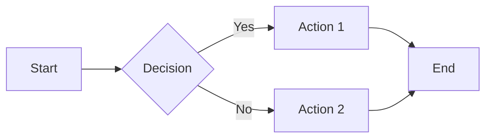

# MkDocs Syntax Reference

This page demonstrates all available MkDocs Material syntax with minimal examples.

## Headers

# H1 Header
## H2 Header  
### H3 Header
#### H4 Header
##### H5 Header
###### H6 Header

## Text Formatting

**Bold text** and *italic text* and ~~strikethrough~~

`Inline code` and normal text

## Links
[google](www.gooogle.com )
[External link](https://mkdocs.org)

[Internal link](index.md)

## Lists

### Unordered Lists
- Item 1
- Item 2
  - Nested item
  - Another nested item

### Ordered Lists
1. First item
2. Second item
   1. Nested numbered item
   2. Another nested item

### Task Lists
- [x] Completed task
- [ ] Incomplete task

## Tables

| Column 1 | Column 2 | Column 3 |
|----------|----------|----------|
| Row 1    | Data     | More data|
| Row 2    | Info     | Details  |

## Code Blocks

### Single Language
```python
def hello():
    print("Hello World")
```

### Multi-Language Tabs
=== "REsponse"
    ```python
    print("Hello from Python")
    ```

=== "REquest"
    ```javascript
    console.log("Hello from JS");
    ```

=== "Bash"
    ```bash
    echo "Hello from Bash"
    ```

## Admonitions

!!! note
    This is a note admonition.

!!! warning
    This is a warning admonition.

!!! tip
    This is a tip admonition.

!!! info "Custom Title"
    This is an info admonition with custom title.

!!! danger "⚠️ Critical"
    This is a danger admonition with emoji.

### Collapsible Admonitions

??? question "Click to expand"
    This content is hidden by default.

???+ success "Expanded by default"
    This content is shown by default but can be collapsed.

## Keyboard Keys

Press ++ctrl+alt+delete++ to restart.

Use ++cmd+c++ to copy and ++cmd+v++ to paste.

## Footnotes

Here's some text with a footnote[^1].

Here's another footnote[^2].

[^1]: This is the first footnote.
[^2]: This is the second footnote.

## Math (KaTeX)

### Inline Math
Inline math: $E = mc^2$ and $\sum_{i=1}^{n} x_i = x_1 + x_2 + \cdots + x_n$

### Block Math
$$
\int_{-\infty}^{\infty} e^{-x^2} dx = \sqrt{\pi}
$$

### Multiple Equations
$$
\begin{align}
f(x) &= ax^2 + bx + c \\
f'(x) &= 2ax + b \\
f''(x) &= 2a
\end{align}
$$

### Matrix Example
$$
\begin{pmatrix}
a & b \\
c & d
\end{pmatrix}
\begin{pmatrix}
x \\
y
\end{pmatrix} = 
\begin{pmatrix}
ax + by \\
cx + dy
\end{pmatrix}
$$

### Alternative Delimiters
Using parentheses: \(x^2 + y^2 = z^2\)

Using brackets: \[E = \frac{mc^2}{\sqrt{1-\frac{v^2}{c^2}}}\]

## Images


## Blockquotes

> This is a blockquote.
> 
> It can span multiple lines.
> 
> > Nested blockquote

## Horizontal Rules

---

## HTML Elements

<mark>Highlighted text</mark>

<kbd>Ctrl</kbd> + <kbd>C</kbd>

<sub>subscript</sub> and <sup>superscript</sup>

## Abbreviations

*[API]: Application Programming Interface
*[HTTP]: HyperText Transfer Protocol

The API uses HTTP protocol.

## Definition Lists

Term 1
:   Definition for term 1

Term 2
:   Definition for term 2
:   Another definition for term 2

## Emoji

:smile: :heart: :thumbsup: :rocket: :fire:

## Content Tabs

=== "Tab 1"
    Content for tab 1

=== "Tab 2"
    Content for tab 2

=== "Tab 3"
    Content for tab 3

## Complex Example

!!! example "API Response Format"

    === "Success Response"
        ```json
        {
          "status": "success",
          "data": {
            "id": 123,
            "name": "John Doe"
          }
        }
        ```

    === "Error Response"
        ```json
        {
          "status": "error",
          "message": "User not found",
          "code": 404
        }
        ```

    !!! tip
        All responses include appropriate HTTP status codes.

## Details/Summary

<details>
<summary>Click to expand raw HTML details</summary>
This content is hidden until clicked.
</details>

## Mermaid Diagrams



## Highlight Text

==Highlighted text== using double equals.

Text with ^^underline^^ and ~~strikethrough~~.

## Critic Markup

{--Deleted text--}

{++Added text++}

{~~Original~>Replacement~~}

{==Highlighted text==}

{>>Comment<<}

---

!!! success "Complete Reference"
    This page covers all major MkDocs Material syntax features. Each element above can be copied and modified for your documentation needs!